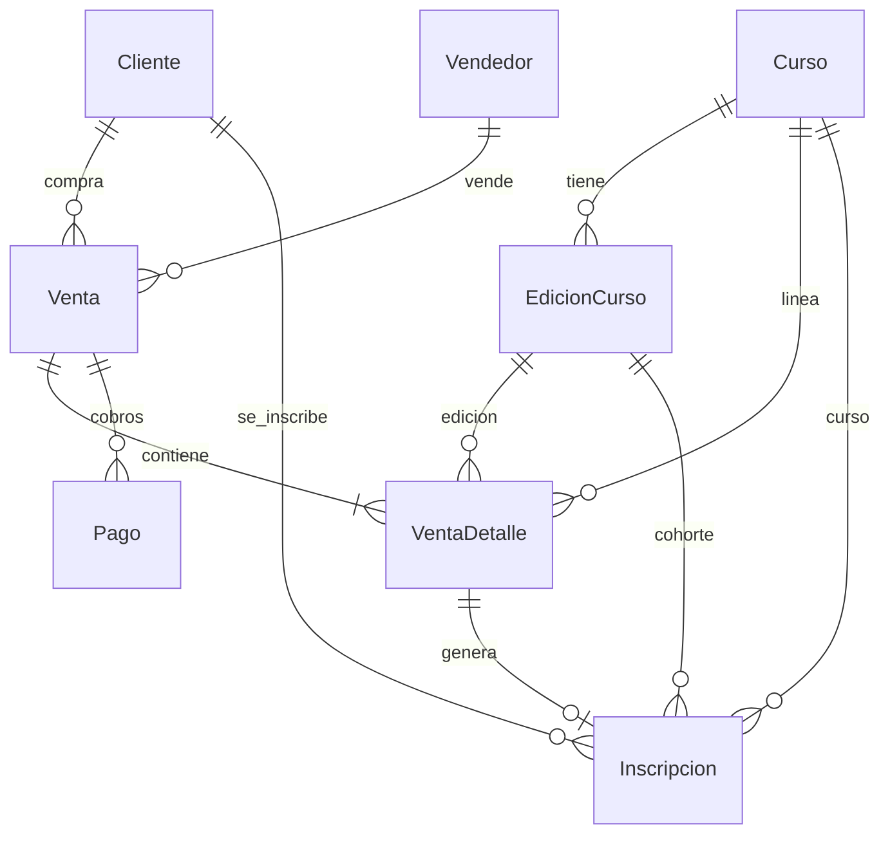

# Ventas Ingenio — Arquitectura

Sistema monolítico Django para **venta e inscripción de cursos** del ecosistema Modelo Ingenio.

## Patrón arquitectónico

| Capa | Implementación |
|------|----------------|
| **Presentación** | Templates Django + Bootstrap 5 + design tokens (`tokens.css`, `app.css`) |
| **Navegación** | Sidebar fija + topbar (`base.html`, `includes/sidebar.html`) |
| **Controladores** | Function-based views (`@login_required`), POST → redirect (PRG) |
| **Formularios** | `ModelForm` por entidad, modales Bootstrap para CRUD |
| **Persistencia** | PostgreSQL dual: `default` (negocio) + `auth` (usuarios Django) |
| **Router** | `AuthRouter` enruta auth/admin/sessions a BD `auth` |
| **Integración** | `services.py` + `signals.py` (SII alumnos, Aula inscripciones) |
| **Deploy** | Vercel serverless + WhiteNoise + `AutoMigrateMiddleware` + `db_schema.py` |

## Modelo de datos

### Entidades

| Modelo | Tabla | Descripción |
|--------|-------|-------------|
| **Cliente** | `cat_cliente` | Comprador/alumno (CURP, empresa, `id_alumno_sii`) |
| **Vendedor** | `cat_vendedor` | Comercial vinculado a `auth.User` por `user_id` |
| **Curso** | `cat_producto` | Catálogo de cursos (legacy column names) |
| **EdicionCurso** | `cat_edicion_curso` | Cohorte: fechas, cupo, precio override |
| **Venta** | `tra_venta` | Encabezado: folio, estado, estado_pago |
| **VentaDetalle** | `tra_venta_det` | Línea: curso, edición opcional, precio snapshot |
| **Pago** | `tra_pago` | Cobros parciales o totales de una venta |
| **Inscripcion** | `tra_inscripcion` | Matrícula del cliente a curso/edición |

## Pantallas

| Ruta | Pantalla |
|------|----------|
| `/ventas/` | Panel de control (KPIs) |
| `/ventas/carrito/` | Punto de venta multi-curso/edición |
| `/ventas/ventas/` | Historial de ventas |
| `/ventas/pagos/` | Registro de pagos |
| `/ventas/inscripciones/` | Matrículas activas |
| `/ventas/clientes/` | CRUD clientes |
| `/ventas/vendedores/` | CRUD vendedores |
| `/ventas/cursos/` | CRUD catálogo |
| `/ventas/ediciones/` | CRUD cohortes |

## Flujo de venta

1. Vendedor inicia sesión → panel o punto de venta.
2. Selecciona cliente, curso y opcionalmente **edición** (valida cupo).
3. Confirma venta → crea `Venta`, `VentaDetalle`, `Inscripcion`.
4. Registra **pagos** en `/ventas/pagos/` → actualiza `estado_pago`.
5. Signals sincronizan alumno (SII) e inscripción (Aula) de forma best-effort.

## Migraciones

| # | Archivo | Propósito |
|---|---------|-----------|
| 0001 | initial | Esquema legacy producto/venta |
| 0002 | dominio_cursos_vendedores | Curso, Vendedor, campos extendidos |
| 0003 | ensure_schema_postgres | SQL idempotente Neon |
| 0004 | dominio_completo | Ediciones, Pagos, Inscripciones, folio |

## Esquema SQL canónico

Ver `ventas-sql/init.sql` y respaldo runtime en `api/db_schema.py`.
